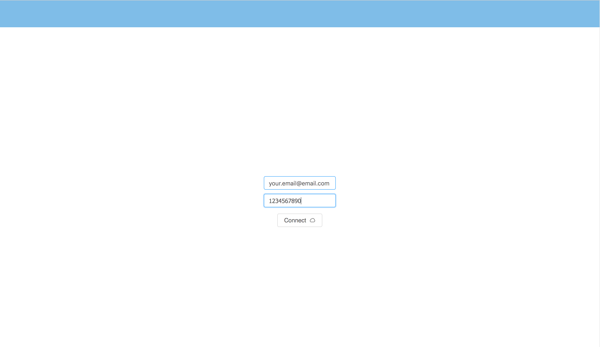
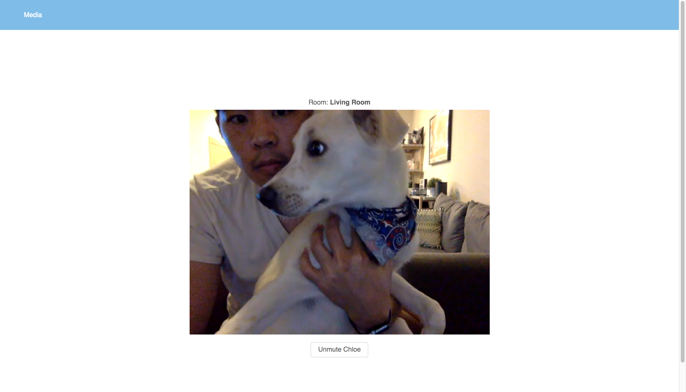

# pet-cam-fg
Pet cam client and API that serves connection to user and their pet. This project is intended to run alongside [pet-cam-aa](https://github.com/wongbros/automatic-adventure).

## Description
A web application that securely connects a user with their pet over web cam. A user can simply login using their Google account and setup details including a whitelist of phone numbers that are allowed to connect to their room. After starting the camera, only the user with their hashed url, which can be obtained via SMS to ensure privacy, can connect to the camera.

Identifier
----


Pet Video Feed
----


## Team
  - [Brandon Wong](https://github.com/blhwong)
  - [Brian Wong](https://github.com/brianlwong)

## Table of Contents
1. [Technologies](#Technologies)
1. [Requirements](#Requirements)
1. [Tasks](#Tasks)
1. [Contributing](#contributing)

## Technologies

### Frontend
- React (ES6)
- React Router
- Ant Design
- Create react app

### Backend
- Node
- Express
- MongoDB + Mongoose
- Socket.io

### Other
- Heroku
- Twilio
- Mocha + Chai
- Google OAuth2
- PassportJS

## Requirements
- Node 8.9.x
- React 16.4.x
- React Router DOM 4.2.x

## Setup
Begin by forking project. Clone down the forked repo:
```
git clone <your forked url>
```
cd to the root directory of the project
```
cd friendly-giggle/
```
install dependencies
```
npm install
```
start database
```
mongod
```
Note: if this fails, try ``` sudo mongod ```

start server
```
npm run dev-server
```
start client
```
npm run dev-client-https
```
Start hacking!

## Dotenv
Create .env file as shown below
```
PORT=
REACT_APP_SERVER_BASE
```

## Issues
View the project scrum board [here](https://github.com/orgs/wongbros/projects/1)

## Contributing
See [CONTRIBUTING.md](CONTRIBUTING.md) for contribution guidelines.
